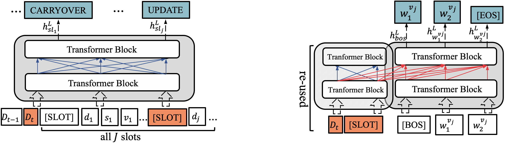
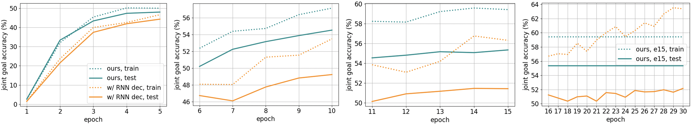

# Transformer-DST


This code is the official pytorch implementation of [Jointly Optimizing State Operation Prediction and Value Generation for Dialogue State Tracking](https://arxiv.org/abs/1911.03906).<br>

<p align="left"></p>

Notice that this model only consists of a single BERT (base-uncased).

## Requirements

```
python3.7
pytorch-transformers==1.0.0
torch==1.5.0+cu101
torchvision=0.6.0+cu101
wget==3.2
```

## Download and Preprocess data

Download the MultiWOZ (2.1 and 2.0) dataset and preprocess it: 
```
sh -x ./run_get_data.sh
```


## Model Training

To train the model, please run this script. <br>
```
sh -x ./run_train_dt.sh  # MultiWoz 2.1
sh -x ./run_train_dt_V20.sh  # MultiWoz 2.0
```


## Model Evaluation

Run this script:
```
sh -x ./run_test.sh
```
Some options are: 
```
--gt_op: give the ground-truth operation for the evaluation.
--gt_p_state: give the ground-truth previous dialogue state for the evaluation.
--gt_gen: give the ground-truth generation for the evaluation.
--eval_all: evaluate all combinations of these.
```

### Evaluation Results on MultiWoz 2.1

<p align="left"></p>

Detailed results of Transformer-DST at 15-th epoch:  
```
op_code: 4, is_gt_op: False, is_gt_p_state: False, is_gt_gen: False
Epoch 15 joint accuracy :  0.5534744842562432
Epoch 15 slot turn accuracy :  0.9756740861382059
Epoch 15 slot turn F1:  0.9249954757030874
Epoch 15 op accuracy :  0.9762079261671601
Epoch 15 op F1 :  {'delete': 0.034934497816593885, 'update': 0.8153223630968437, 'dontcare': 0.32997481108312343, 'carryover': 0.9875716994520346}
Epoch 15 op hit count :  {'delete': 24, 'update': 7556, 'dontcare': 131, 'carryover': 208070}
Epoch 15 op all count :  {'delete': 1338, 'update': 10430, 'dontcare': 592, 'carryover': 208680}
Final Joint Accuracy :  0.39039039039039036
Final slot turn F1 :  0.9166763820537805
Latency Per Prediction : 138.790865 ms
-----------------------------
hotel 0.5200927357032458 0.9753219989696136
train 0.7239742285520515 0.9874759805583887
restaurant 0.6953504510756419 0.9876127689104863
attraction 0.7110563090834361 0.9893821071379706
taxi 0.559190031152648 0.9795430944963626
```

You can download Transformer-DST at 15-th epoch from [here](https://drive.google.com/file/d/19hGZGt33K-bz3bf6HaHKmLTsKMC2yp93/view?usp=sharing).


## Reproducibility
This code is based on open-source code of [SOM-DST](https://github.com/clovaai/som-dst) (Thanks!). 
We can reproduce our experimental results on a P100 GPU device using 42 as random seed. 


## Citation

```bibtex
@article{zeng2020multi,
  title={Multi-Domain Dialogue State Tracking--A Purely Transformer-Based Generative Approach},
  author={Zeng, Yan and Nie, Jian-Yun},
  journal={arXiv preprint arXiv:2010.14061},
  year={2020}
}
```


## Contact

If you have any questions, feel free to contact Yan Zeng ([yan.zeng@umontreal.ca](mailto:yan.zeng@umontreal.ca)).

